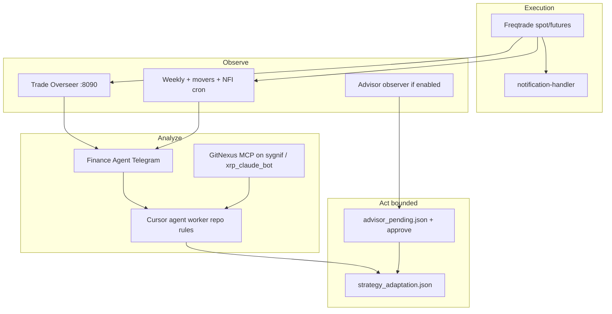

# EC2 finance & strategy workflow (canonical)

**Host:** `ec2-eu` / `freqtrade` (Ubuntu, `~/` paths below)  
**Purpose:** Single map of **Freqtrade + Finance Agent + Cursor agent + Trade Overseer** and what already runs automatically.

> Existing detail: `~/finance_agent/auto_improvement_workflow.md` (same ideas, deeper).  
> Cursor worker rules: `~/xrp_claude_bot/AGENTS.md`, `.cursor/rules/*.mdc`.

---

## 1. Runtime topology (what is always on)

| Component | How it runs | Port / surface |
|-----------|-------------|----------------|
| **Freqtrade (spot)** | Docker `freqtrade` | `:8080` |
| **Freqtrade (futures)** | Docker `freqtrade-futures` | `:8081` |
| **Notification handler** | Docker `notification-handler` | `127.0.0.1:8089` |
| **Trade Overseer** | Docker `trade-overseer` | `8090` (→ FT APIs inside compose network) |
| **Finance Agent** | Host `bot.py` (Telegram); code under `~/finance_agent` and mirror `~/xrp_claude_bot/finance_agent` | Telegram / HTTP per `bot.py` |
| **Cursor Cloud Agent** | Documented as worker on `~/xrp_claude_bot` (systemd name referenced in auto_improvement doc) | SSH / Cursor |

Compose root: **`~/xrp_claude_bot/docker-compose.yml`**.

---

## 2. Scheduled jobs (cron — already active)

| Schedule | Label (Telegram wrap) | Script |
|----------|------------------------|--------|
| `0 */6 * * *` | NFI update | `~/finance_agent/update_nfi.sh` → log `~/finance_agent/nfi_update.log` |
| `0 */4 * * *` | movers | `python3 ~/xrp_claude_bot/update_movers.py` → `movers_update.log` |
| `0 6 * * 0` | weekly strategy analysis | `python3 ~/xrp_claude_bot/scripts/weekly_strategy_analysis.py` → `~/.local/share/sygnif-agent/weekly_analysis.log` |

Wrapper: **`~/xrp_claude_bot/scripts/cron_wrap_tg.sh`** (notifications on failure/summary).

---

## 3. End-to-end strategy loop (human + agents)

### Roles

1. **Freqtrade** — live orders, `SygnifStrategy` / `MarketStrategy` (per compose), SQLite, `user_data/*`.
2. **Finance Agent** — market/TA/research, `/sygnif` bundles, mode routing (`mode_router.py`); **analysis-first** unless you explicitly request code changes.
3. **Cursor agent** — implements edits in `~/xrp_claude_bot` with `.cursor/rules` + GitNexus expectations in `AGENTS.md`.
4. **Trade Overseer** — open-trade commentary, `/overview`, `/trades`; uses `FT_SPOT_URL` / `FT_FUTURES_URL` to both APIs.

---

## 4. Key paths (EC2)

| Path | Contents |
|------|----------|
| `~/xrp_claude_bot/user_data/` | `config.json`, `config_futures.json`, strategies, data, logs, `movers_pairlist.json`, `doom_cooldown.json` |
| `~/xrp_claude_bot/trade_overseer/` | **Docker build context** for overseer (`overseer.py`, `ft_client.py`, `data/`) |
| `~/finance_agent/` | `bot.py`, prompts, `auto_improvement_workflow.md`, `update_nfi.sh` |
| `~/.local/share/sygnif-agent/` | Weekly analysis logs (cron) |

---

## 5. Operating checklist (weekly)

- [ ] Skim **Overseer** + **Telegram** for repeated exit reasons (SL / swing / strong_ta).
- [ ] Read **weekly** log + `strategy_adaptation_weekly.json` if present.
- [ ] **GitNexus:** `npx gitnexus analyze` in `~/xrp_claude_bot` if index stale (per `AGENTS.md`).
- [ ] **Movers / whitelist:** confirm `movers_pairlist.json` mtime vs `update_movers` cron.
- [ ] **Disk:** `user_data/logs`, SQLite size (see companion network/finance hygiene doc).

---

## 6. Explicit non-goals

- No autonomous **approve** of exchange risk without human or `/sygnif approve` (per auto_improvement doc).
- Do not add heavy always-on services on this box without resizing EC2 (see `EC2_NETWORK_EVOLUTION_WORKFLOW.md`).

---

*Generated from EC2 inventory scan; align with `~/finance_agent/auto_improvement_workflow.md` for mermaid/trigger tables.*
