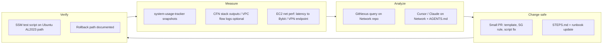

# EC2 + Network repo — continuous improvement workflow

**Scope:** Improve **network behaviour, cost, and operability** without ballooning the trading host.  
**Repo:** `~/Network` (remote: `https://github.com/Giansn/Network.git`, branch `main`)  
**Companion:** `~/network-dev-agents/` (local experiments; keep heavy jobs off tiny instances).

> Existing agent rules: `~/Network/AGENTS.md` (GitNexus **Network** index, AWS/VPN/SSM conventions).

---

## 1. What lives in `~/Network`

| Area | Role |
|------|------|
| **`aws-node-network/`** | CloudFormation, Client VPN TLS, SSM scripts — start from `STEPS.md` |
| **`edge_npu_infer/`** | OpenVINO NPU/CPU smoke, optional MCP; **SSM** from Windows (`Invoke-SsmRunEdgeInfer.ps1`) |
| **`system-usage-tracker/`** | Windows usage CSV + `Get-NetworkSnapshot.ps1` — **baseline behaviour / efficiency signals** |
| **`state/`** | Ephemeral or hand-off state (do not commit secrets) |

---

## 2. Continuous improvement loop (network)



### Principles

1. **One concern per change** — avoid “big bang” CFN edits without drift check.
2. **LF line endings** for bash embedded from Windows (see `Network/AGENTS.md`).
3. **No secrets in git** — `my-params.json`, `*.ovpn`, `vpn-certs-work/` stay local.
4. **Trading host stays lean** — run **large builds / NPU experiments** on designated targets via SSM or separate instance, not on the Freqtrade Docker host unless sized for it.

---

## 3. Cadence (suggested)

| Cadence | Action |
|---------|--------|
| **Weekly** | Review **usage tracker** export (if Windows workstation is in path): spot bandwidth/latency anomalies. |
| **Monthly** | **GitNexus** `npx gitnexus analyze` in `~/Network` on dev machine; `query` for “SSM”, “VPN”, “security group”. |
| **Per change** | `gitnexus_impact` on edited symbol (per `AGENTS.md`); update `STEPS.md` if operator steps change. |
| **Quarterly** | Cost pass: NAT, VPN, idle EIPs, log retention (align with AWS console / Cost Explorer). |

---

## 4. EC2 trading instance — network-specific hygiene

These protect **both** trading and SSH reliability:

- [ ] **Security groups:** only required ports (22/443/8080/8081 as needed); avoid wide `0.0.0.0/0` on APIs.
- [ ] **Client VPN** (if used): certificate rotation documented in `aws-node-network/`.
- [ ] **DNS / time:** `chrony` healthy (affects TLS to Bybit and Telegram webhooks).
- [ ] **Docker networking:** overseer reaches `freqtrade:8080` / `freqtrade-futures:8081` by **service name**, not `127.0.0.1` from container.

---

## 5. “Already going” alignment

This workflow **does not replace** existing automation; it **layers**:

| Existing | Fits loop as |
|----------|----------------|
| `Network/AGENTS.md` + GitNexus | **Analyze** gate before edits |
| `system-usage-tracker` | **Measure** (behaviour / efficiency proxy) |
| `edge_npu_infer` + SSM scripts | **Verify** remote infer / packaging |
| Cron on trading EC2 (movers/NFI/weekly) | **Separate** from Network repo — only **intersect** at host sizing and SG rules |

---

## 6. Quick commands (EC2)

```bash
cd ~/Network && git status && git pull
# After local edits on a dev machine: push, then on EC2
```

```bash
# Optional: snapshot disk / docker usage (efficiency)
df -h && docker system df
```

---

*Use with `docs/EC2_FINANCE_STRATEGY_WORKFLOW.md` for full-machine operations picture.*
