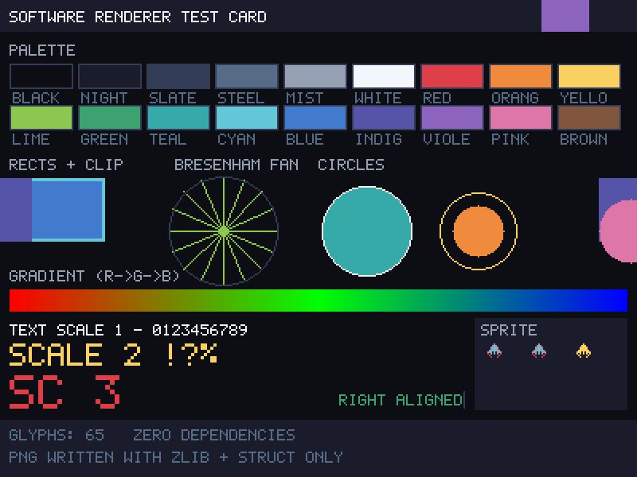

# gamedev — learning to build games

Self-directed game development work, done as running code. Two phases.

**Phase 1 — build a 2D engine from scratch** to learn what an engine actually
does, in Python with nothing but the standard library. Four modules and a
complete game.

**Phase 2 — prepare for a real engine**, Unity and Unreal, by moving the parts
that survive onto both and finding out which parts those are.

Nothing here is part of the SYGNIF trading system; it shares the repository, not
the runtime.

---

## Verify everything

```bash
gamedev/realengine/verify.sh
```

```
PASS  Python core (from-scratch engine)          140 tests
PASS  C# core (Unity scripting target)            68 tests, ~150 ms
PASS  Unity adapters (compile against shim)
PASS  C++ core (Unreal build settings)            38 tests, 1542 checks
PASS  Unreal module (compile against shim)
```

---

## Phase 1: the from-scratch engine

Zero dependencies — no pygame, no numpy, not even pytest. Everything is stdlib,
including the image output.

| Path | What |
|---|---|
| `engine/loop.py` | Fixed-timestep loop: accumulator, render interpolation, spiral-of-death clamp |
| `engine/vec.py` | Immutable 2D vector maths |
| `engine/rng.py` | PCG32, verified against the reference implementation's published test vectors |
| `engine/collision.py` | AABB overlap, minimum translation, swept AABB, ray casts, move-and-slide |
| `engine/tilemap.py` | Tile grid with a broadphase that scales with entity size, not level size |
| `engine/input.py` | Held / just-pressed / just-released, with tick-accurate edges |
| `render/surface.py` | Software rasteriser: clipped rects, Bresenham lines, circles, sprites |
| `render/png.py` | PNG encoder over stdlib `zlib`, with adaptive per-scanline filtering |
| `render/font.py` | Hand-authored 5×7 bitmap font, 65 glyphs |
| `games/pong.py` | A complete game: rallies, scoring, a beatable AI opponent |

```bash
python3 -m unittest discover -s gamedev/tests -t .   # 140 tests
python3 -m gamedev.render.testcard                    # renders out/testcard.png
python3 -m gamedev.games.pong                         # plays a full match, saves frames
```

**Writing a PNG encoder was the highest-leverage decision in phase 1.** It turned
"the collision response works" from an assertion about numbers into a picture I
could look at. Three layout bugs in the very first test card were obvious on
sight and would have survived any reasonable set of assertions.



---

## Phase 2: real-engine preparation

See **[`realengine/README.md`](realengine/README.md)**. In short: gameplay logic
lives in a library with **no engine reference**, and the engine layer is thin
adapters. That is standard practice, and it is also what made the work provable
in an environment where neither editor can be installed — Unity gameplay code is
plain C#, Unreal gameplay code is plain C++, and both compile and unit-test
headlessly as long as they do not reference the engine.

| Document | What |
|---|---|
| [`realengine/PORT_PLAN.md`](realengine/PORT_PLAN.md) | Every subsystem mapped onto both engines: keep, wrap, or delete |
| [`realengine/LEARNING_PATH.md`](realengine/LEARNING_PATH.md) | Milestone curriculum through the engines' own subsystems |
| [`realengine/TOOLCHAIN.md`](realengine/TOOLCHAIN.md) | What is installed, what the shims prove, how to reproduce |

The same seed now produces the same world in **Python, C# and C++** — asserted
in each language against values generated by the Python original.

---

## [`NOTES.md`](NOTES.md) — the learning journal

The actual record of what went wrong: the accumulator that silently dropped a
tick, the collision skin that scaled with speed, the Pong match between two
competent AIs that could never end, the intercept predictor that was wrong by
half a ball twice over, and the bias I suspected and then measured and did not
have.

---

## Honest limits

- **Phase 1 stopped mid-module.** Platformer game feel — coyote time, jump
  buffering, variable jump height — was in progress when the direction changed.
  The tilemap that supports it is done and tested; the platformer is not.
  Pathfinding, procedural generation and the many-entity spatial hash were
  planned and not reached.
- **Phase 2 has never run an editor.** The adapters compile against hand-written
  shims, which verifies types and syntax and nothing about engine behaviour. No
  rendering, asset, audio or build-pipeline work has been done — that is the
  majority of what using an engine involves and it is laid out as open
  milestones in `LEARNING_PATH.md`.
