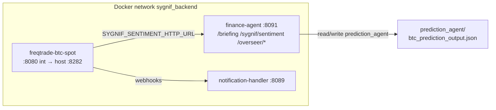

# BTC trading Docker — design aligned with **ruleprediction-agent** + **sygnif-agent-inherit**

**Scope:** optional **second** Freqtrade container — **BTC spot only**, same Sygnif stack (strategy, sentiment, notifications), lower RAM footprint than multi-pair spot.  
**Not implemented** in root `docker-compose.yml` until you merge this design; copy fragments from §6.

**btc_Trader_Docker:** dediziertes Image **`docker/Dockerfile.btc_trader`** (= `Dockerfile.custom` + **`yfinance`** im Container, kein PEP 668/`--break-system-packages` auf dem Host). Build/Rollout: **`letscrash/BTC_TRADER_DOCKER.md`**.

**Naming (Cursor):**

| User slash | Canonical file |
|------------|------------------|
| **`/ruleprediction-agent`** | `.cursor/rules/ruleprediction-agent.mdc` — briefing **:8091**, RAM, bounded learning, no duplicate prediction HTTP |
| **`/sygnif-inherit-agent`** | **`.cursor/rules/sygnif-agent-inherit.mdc`** (always-on worker identity — *inherit* doc, not a separate “agent” binary) |

The BTC Docker **runtime** does not load `.mdc` files; operators and **Cursor Sygnif Agent** use those rules when **designing, reviewing, or editing** compose/config/strategy for this stack.

---

## 1. Design goals

1. **Inherit Sygnif behaviour** per **sygnif-agent-inherit**: same **`SygnifStrategy`**, same **`finance_agent` HTTP sentiment** contract (`SYGNIF_SENTIMENT_HTTP_URL` → `http://finance-agent:8091/sygnif/sentiment`), same notification routing patterns.
2. **Respect ruleprediction-agent:** one **finance-agent** listener on **8091** (`/briefing`, sentiment, overseer); **no** second `http_main` inside the BTC trader image for briefing. **`prediction_agent/`** stays on **finance-agent** (or host) for runner/JSON — not required inside the BTC Freqtrade container unless you later add an explicit read-only hook.
3. **RAM:** one pair, low **`max_open_trades`**, optional **`mem_limit`** in Compose; avoid colocating heavy **`btc_predict_runner`** fits on the same tiny host **while** this bot is under load unless sized.

---

## 2. Architecture (logical)



- **BTC trader** = Freqtrade only (API + strategy + exchange). **No** embedded briefing server.
- **Sentiment / MLP / optional prediction files** = **finance-agent** only (matches inherit: `finance_agent/bot.py` is the HTTP surface).

---

## 3. Mapping — **sygnif-agent-inherit** → BTC container

| Inherit topic | How the BTC Docker honours it |
|----------------|--------------------------------|
| **`SygnifStrategy`**, `user_data/strategies/` | Image **`docker/Dockerfile.btc_trader`** (oder `Dockerfile.custom` wenn identisch ohne `yfinance`); mount **`./user_data`** so strategy file matches main spot bot (or pin a branch-specific copy — still one codebase). |
| **`strategy_adaptation.json`** | **Shared** `user_data/` → **same** hot-reload file as other bots. **Risk:** two live bots read the same JSON; acceptable if you treat adaptation as **global policy**, dangerous if you want per-bot overrides (would need strategy code change — out of scope). |
| **`finance_agent/bot.py` semantics** | Not mounted in trader; trader only calls **HTTP** sentiment URL — same as current `freqtrade` / `freqtrade-futures` services. |
| **Tests / `SygnifStrategy.py` root copy** | Unaffected by Docker; still sync strategy per repo rules. |
| **Analysis-only default** | Compose can set `dry_run: true` in dedicated `config_btc_spot_dedicated.json` until you promote live. |

---

## 4. Mapping — **ruleprediction-agent** → BTC container

| Rule topic | Design choice |
|------------|----------------|
| **Single :8091 listener** | BTC Freqtrade **does not** bind 8091; only **finance-agent** does. |
| **RAM / one heavy job** | `max_open_trades`: 2–4; pairlist **Static** `BTC/USDT` only; optional `deploy.resources.limits.memory` for `freqtrade-btc-spot`. |
| **Prediction not silent-wired** | Trader does **not** read `btc_prediction_output.json` unless you add a **documented** strategy hook later; runner stays on finance-agent mount. |
| **Horizon / learning** | Mechanical checks still **`scripts/prediction_horizon_check.py`** on host/CI — not inside trader container. |

---

## 5. Config (`user_data/config_btc_spot_dedicated.json`)

**Start from** **`user_data/config_btc_spot_dedicated.example.json`**: copy → `config_btc_spot_dedicated.json`, set Bybit **`key`/`secret`**, replace **`jwt_secret_key`** (e.g. `openssl rand -hex 32`) and **`api_server.password`**, tune **`dry_run`**. Example uses **`max_open_trades`: 3**, **`pair_whitelist`** `["BTC/USDT"]` only, **`StaticPairList`**, **`telegram.enabled`: false** (rely on `notification-handler` webhooks unless you want direct bot Telegram). CORS includes **`:8282`** for a dedicated dashboard proxy.

**API host port:** map **host `8282` → container `8080`** so **8181** (main spot) and **8081** (futures) stay unchanged.

---

## 6. Compose fragment (merge manually)

```yaml
  freqtrade-btc-spot:
    build:
      context: .
      dockerfile: "./docker/Dockerfile.btc_trader"
    restart: unless-stopped
    container_name: freqtrade-btc-spot
    networks:
      - sygnif_backend
    extra_hosts:
      - "host.docker.internal:host-gateway"
    volumes:
      - "./user_data:/freqtrade/user_data"
      - "./trade_overseer:/freqtrade/trade_overseer"
    env_file:
      - .env
    ports:
      - "127.0.0.1:8282:8080"
    environment:
      SYGNIF_SENTIMENT_HTTP_URL: ${SYGNIF_SENTIMENT_HTTP_URL:-http://finance-agent:8091/sygnif/sentiment}
    depends_on:
      finance-agent:
        condition: service_started
      notification-handler:
        condition: service_started
    # Optional: deploy:
    #   resources:
    #     limits:
    #       memory: 2G
    command: >
      trade
      --logfile /freqtrade/user_data/logs/freqtrade-btc-spot.log
      --db-url sqlite:////freqtrade/user_data/tradesv3-btc-spot.sqlite
      --config /freqtrade/user_data/config_btc_spot_dedicated.json
      --strategy SygnifStrategy
```

**notification-handler:** ensure webhook / `trading_mode` (or equivalent) distinguishes this bot from `freqtrade` if Telegram copy must be tagged “BTC spot” — align with existing payload fields in `notification_handler.py` (verify before go-live).

---

## 7. Rollout phases

| Phase | Action |
|-------|--------|
| P0 | Add **`config_btc_spot_dedicated.json`** (dry-run, BTC only, new DB path). |
| P1 | Add service to compose (or `docker compose -f docker-compose.yml -f letscrash/docker-compose.btc-spot.override.yml`). |
| P2 | Dashboard: optional proxy **`dashboard_btc_spot.py`** on **:8892** → `http://127.0.0.1:8282` (mirror `dashboard_server.py` pattern). |
| P3 | **trade-overseer:** extend `FT_*` if overseer should poll this API (second base URL env) — design only unless you need unified plays. |

---

## 8. Checklist before live keys

- [ ] **`dry_run`** false only after review.  
- [ ] **Bybit subaccount** / keys scoped to spot BTC if production.  
- [ ] **Shared `strategy_adaptation.json`**: confirm intentional vs fork per-bot JSON (future code).  
- [ ] **RAM** on instance after 24h `docker stats`.  
- [ ] **ruleprediction-agent** globs satisfied: no new HTTP server on 8091 in trader image.  

---

*Design only — implement in small PRs; keep `letscrash/` as staging notes until merged to main compose.*
