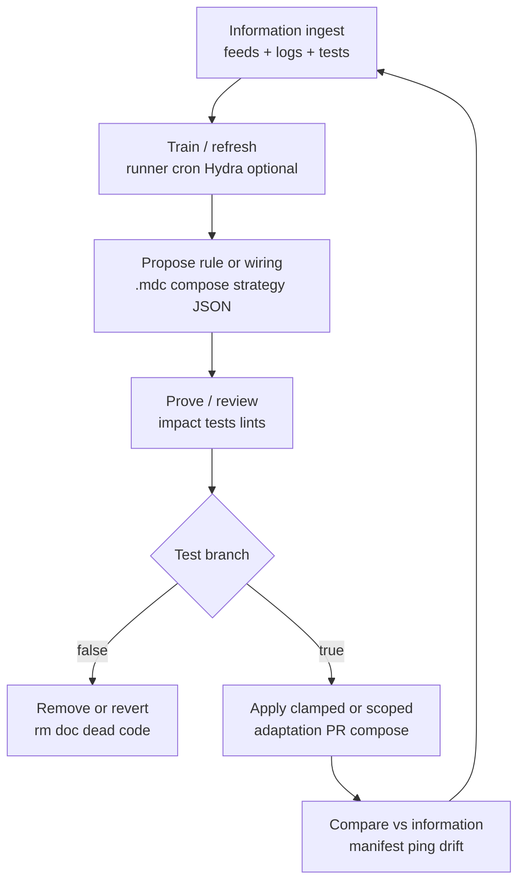

# Continuous rule loop, agent consultation, and **btc_Trader_Docker** data flows

**Under `/ruleprediction-agent`:** treat this file as the **long-form** companion to `.cursor/rules/ruleprediction-agent.mdc` — rules and wiring **evolve**; this document describes the **information → training → rule change → proof → test → apply/remove → compare** loop and concrete **data sources** (TradingView, exchanges, on-chain bundles).

**Rule setting never stops:** each cycle produces evidence; **false** hypotheses → delete or narrow rules/docs; **true** under defined tests → apply (code, `strategy_adaptation.json`, compose, or `.mdc` globs). Re-compare against **live feeds** next cycle.

---

## 1. Consult other agents (before changing rules or Docker)

| Agent / skill | Path | When to pull in |
|---------------|------|------------------|
| **prediction-agent** | `.cursor/agents/prediction-agent.md` | `prediction_agent/`, ML horizons, runner, Pine reference |
| **market-data** | `.cursor/agents/market-data.md` | ErcinDedeoglu daily bundle interpretation, funding/OI context |
| **btc-specialist** | `.cursor/agents/btc-specialist.md` | Bybit spot BTCUSDT, `pull_btc_context`, Sygnif TA semantics |
| **finance-agent** | `.cursor/agents/finance-agent.md` | `/briefing`, Telegram parity, `bot.py` ground truth |
| **sygnif-agent-inherit** | `.cursor/rules/sygnif-agent-inherit.mdc` | Worker identity, skills table, adaptation JSON contract |
| **sygnif-predict-workflow** | `.cursor/rules/sygnif-predict-workflow.mdc` | Predict → Analyze → Proofread → Adjust (narrative + horizon) |

---

## 2. Closed-loop (continuous)

- **Information:** `manifest.json`, Bybit ticker/klines, `btc_prediction_output.json`, horizon check outputs, Docker logs, `/api/v1/ping`, `GET /briefing` shape.
- **Training:** bounded jobs only (see `ruleprediction-agent` RAM section).
- **Rule modify:** `.cursor/rules/*.mdc`, `letscrash/*.md`, compose — version in git; never “silent prod”.
- **Prove:** `pytest`, manual `curl`, `prediction_horizon_check.py check`, GitNexus impact for strategy symbols.
- **If false → rm:** delete misleading lines, revert PR, drop env flags.
- **If true → apply:** merge PR, reload FT adaptation, redeploy container with new image digest.
- **Compare:** same metrics next cycle — detect regime / feed drift.

---

## 3. **btc_Trader_Docker** — directed data flows

| Direction | Channel | Content |
|-----------|---------|---------|
| **In** | `SYGNIF_SENTIMENT_HTTP_URL` | `finance-agent:8091/sygnif/sentiment` — MLP / HTTP sentiment for strategy |
| **In** | Mounted `user_data/` | `SygnifStrategy`, `strategy_adaptation.json`, configs, feather data |
| **In** | Exchange REST/WS | Bybit spot **BTC/USDT** (Freqtrade ccxt) |
| **In** | (optional future) | Read-only mount or HTTP for **prediction** / **yfinance** sidecars — document before enable |
| **Out** | Webhooks | `notification-handler:8089` — trades, fills (align `trading_mode` / `bot_name`) |
| **Out** | Freqtrade REST | Host-mapped port (e.g. **8282** → container **8080**) |
| **Out** | Logs | `user_data/logs/freqtrade-btc-spot.log` |

**No second :8091** inside the trader image — **ruleprediction-agent** port contract.

---

## 4. Indicators and feeds — priority wishlist (extend in PRs)

### TradingView / Pine (repo)

| Item | Location | Use |
|------|----------|-----|
| **5m Pine spec** | `prediction_agent/btc_predict_5m.pine` | Visual / export alignment; **not** live FT unless ported |
| **Custom TV indicators** you add | document path + data export | Map to JSON columns or manual CSV → runner features |

### Exchange / CEX

| Feed | API | Notes |
|------|-----|------|
| Spot OHLCV / ticker | Bybit v5 `category=spot&symbol=BTCUSDT` | Ground for `btc_specialist` + FT |
| Perps (if strategy uses) | Bybit linear | Pair naming `BTC/USDT:USDT` vs spot |

### On-chain / derivatives **daily** (CC BY 4.0)

| Series (examples) | Upstream file | Sygnif consumer |
|--------------------|---------------|-----------------|
| Exchange netflow | `btc_exchange_netflow.json` | `crypto_market_data.py`, briefing subset |
| Funding (daily agg) | `btc_funding_rates.json` | market-data agent |
| Open interest | `btc_open_interest.json` | volatility context |
| MVRV, liquidations, … | other `data/daily/*.json` | extend `DEFAULT_PATHS` / analysis md cautiously |

**Attribution:** [ErcinDedeoglu/crypto-market-data](https://github.com/ErcinDedeoglu/crypto-market-data).

### Other

| Feed | Path / tool |
|------|-------------|
| **yfinance** | In **btc_Trader_Docker** image; use for **off-FT** research only unless explicitly wired |
| **NewHedge** | `NEWHEDGE_API_KEY`, correlation JSON |
| **Horizon discipline** | `scripts/prediction_horizon_check.py` |

---

## 5. “If true apply” — safe apply layers

| Layer | Mechanism |
|-------|-----------|
| Lowest risk | Update **this** markdown + cross-links |
| Low | `strategy_adaptation.json` overrides (clamped) |
| Medium | Compose env / image tag for **btc_Trader_Docker** |
| High | Strategy code, new HTTP routes — **tests + GitNexus impact** |

---

*Iterate: append dated notes at bottom or use git history; keep rules and compose traceable.*
